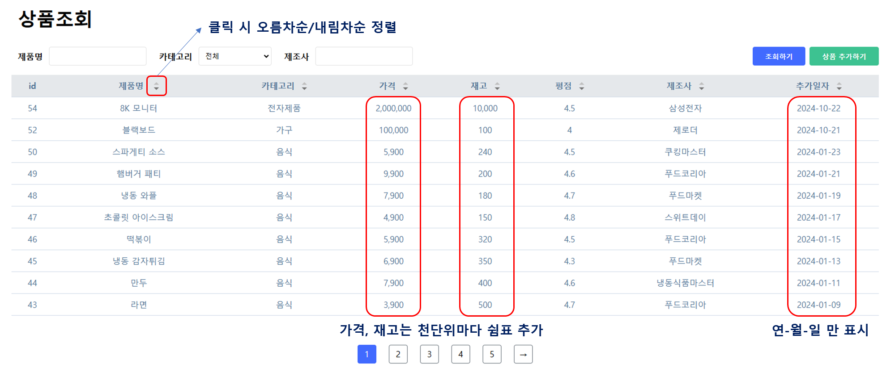

## 상품조회 화면 구현하기

### 구현 및 테스트 방법
- (vscode) 우측 하단에 있는 'Go Live' 버튼을 클릭하여 live server를 실행하면, http://localhost:5500 으로 접속하여 테스트할 수 있습니다. 

- 아래의 요구사항을 구현하기 위해, 제공된 파일 (index.html, style.css, index.js)의 내용을 추가 또는 수정하시면 됩니다.
- 필요한 경우 파일을 새로 생성하여 추가하셔도 무방합니다. 다만 기본적으로 제공되는 파일을 삭제해서는 안됩니다.
- <b><u>REST API의 base url은 http://test.zerorder.kr 입니다.</u></b>

<br/>

### 과제 요구사항

> 기존에 주어진 '상품조회' 화면과 '상품추가' 모달을 바탕으로 아래의 요구사항을 만족하는 기능을 구현합니다.


#### 1. 상품 카테고리 불러오기
- '상품조회' 및 '상품추가' 시 사용자가 선택할 수 있는 카테고리 정보를 불러옵니다.
- '카테고리' 의 \<select> 태그에 들어가는 내용은 하드코딩하지 않고, 아래의 조회 API을 이용하여 동적으로 구성합니다.
```jsonc
(GET) /products/categories
요청 파라미터: 없음

# 응답 예시:

[
    {
        "id": 1, // category_id 를 의미. 
                 // '2.상품 불러오기' 시 요청파라미터로 사용됨 
        "name": "전자제품"
    },
    {
        "id": 2,
        "name": "가구"
    },
    {
        "id": 3,
        "name": "헬스용품"
    },
    {
        "id": 4,
        "name": "주방용품"
    },
    {
        "id": 5,
        "name": "음식"
    }
]
```
<br/>

#### 2. 상품 불러오기
- 사용자로부터 '제품명', '카테고리', '제조사'를 입력받아 해당 조건에 맞는 상품목록을 불러오고, 이를 테이블 형식으로 표시합니다.
    - 테이블 컬럼의 '가격', '재고' 항목은 천단위마다 쉼표가 표시되어야 합니다 (예: 10000 -> 10,000)
    - '가격' 컬럼은 금액과 단위가 같이 표기되어야 합니다 (예: 10,000원)
    - '추가일자'는 연,월,일 정보만 표시합니다 (YYYY-MM-DD)
- 조회 API는 다음과 같습니다.
```jsonc
# (GET) /products

요청 파라미터:
- manufacturer: 제조사 
- productName: 제품명
- categoryId: 카테고리 id. "0" 인 경우 전체 조회. default: "0"
- page (optional): 조회 페이지. default: "1"

# 응답 예시
{
    "totalItems": 52, // 조회가능한 총 상품 갯수
    "totalPages": 6,  // 총 페이지
    "currentPage": 2, // 현재 페이지
    "items": [
        {
            "id": 42,           // 상품 id
            "name": "치킨 너겟", // 상품 이름
            "category_id": 5,   // 카테고리 id
            "price": 12900,     // 가격
            "stock": 250,       // 재고
            "rating": 4.5,      // 평점
            "manufacturer": "푸드마켓",            // 제조사
            "createdAt": "2024-01-07 13:00:00",   // 추가일자 (YYYY-MM-DD HH:mm:ss)
            "category_name": "음식"                // 카테고리 이름
        },
        {
            "id": 41,
            "name": "냉동 피자",
            "category_id": 5,
            "price": 8900,
            "stock": 300,
            "rating": 4.4,
            "manufacturer": "푸드코리아",
            "createdAt": "2024-01-05 12:00:00",
            "category_name": "음식"
        },
        ...
    ]
}

```
- '조회하기' 버튼 클릭 시 해당 조회 조건을 검색하는 페이지로 이동되어야 합니다 &nbsp;(따라서 뒤로가기 시 조회하기 버튼을 누르기 직전의 페이지로 이동되어야 합니다).
- 페이지네이션이 구현되어야 합니다. 이때 한 화면에 보여지는 페이지의 최대 갯수는 5개 입니다.

- 결과예시: 


<br/>

#### 3. 상품 추가하기 모달
- '상품 추가하기'을 클릭하였을 때 아래와 같은 모달이 보여져야 합니다.

- 모달의 바깥부분을 클릭했을 경우 모달이 닫혀야 합니다.
- 모달의 '추가하기' 버튼 클릭 시 아래의 상품 추가 API가 호출되어야 합니다.
```jsonc
(POST) /products
request body: 
{
    "productName": string,  // 제품명
    "categoryId": number,   // 카테고리 id
    "price": number,        // 가격
    "stock": number,        // 재고
    "rating": number,       // 평점
    "manufacturer": string  // 제조사
}

응답: 별도의 데이터 없음
```
- 상품 추가가 정상적으로 완료된 경우, 모달을 닫고 '/' 페이지로 이동합니다.

<br/>

### 과제 제출 방법


> 깃허브 리포지토리를 생성 후 업로드하여 아래의 메일로 URL을 제출합니다. 
> <br/>
> ian@zerorder.kr